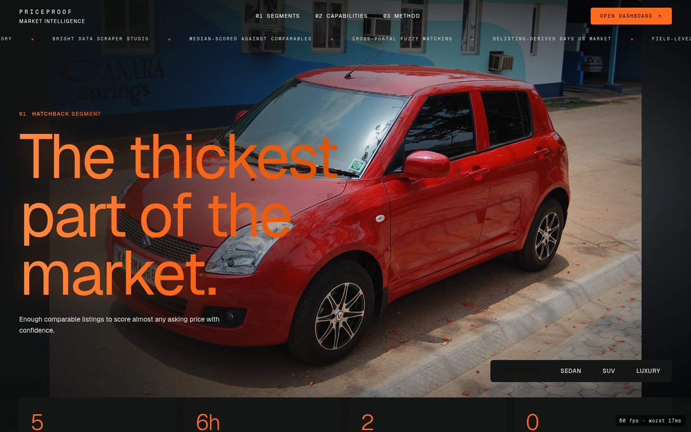
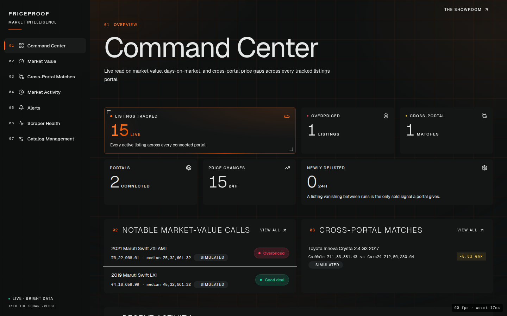
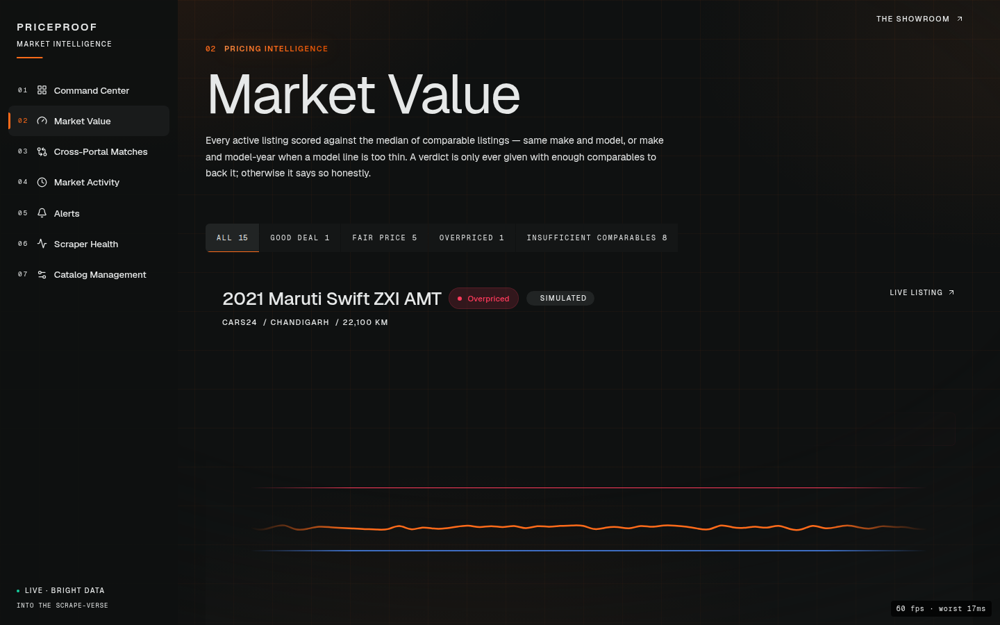
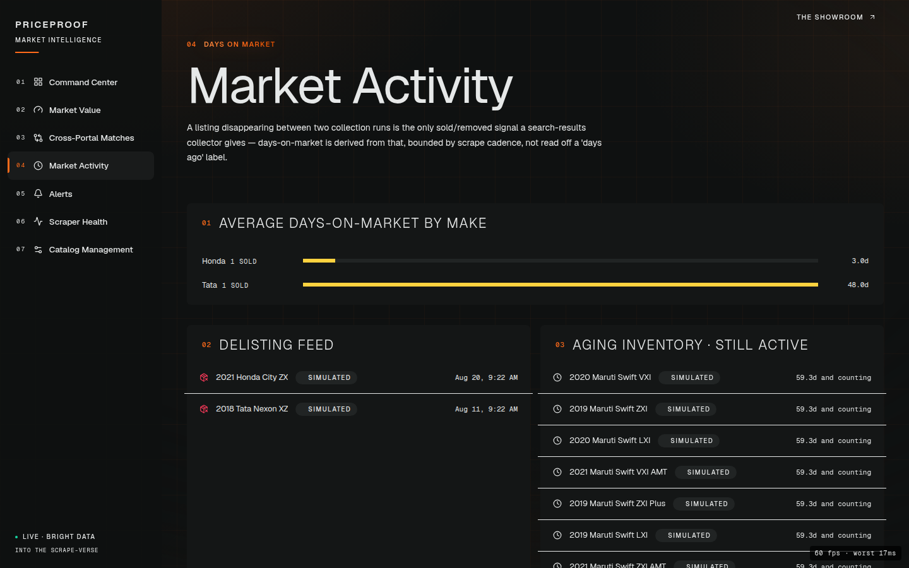
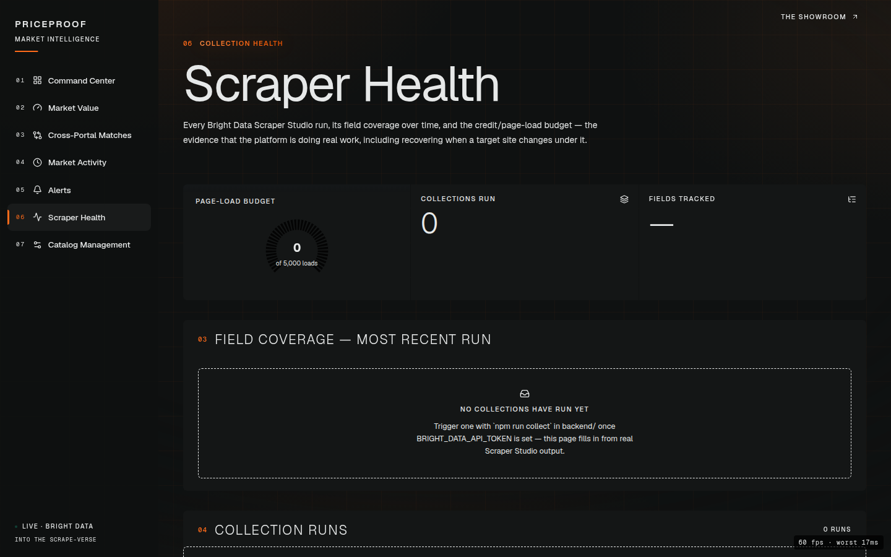
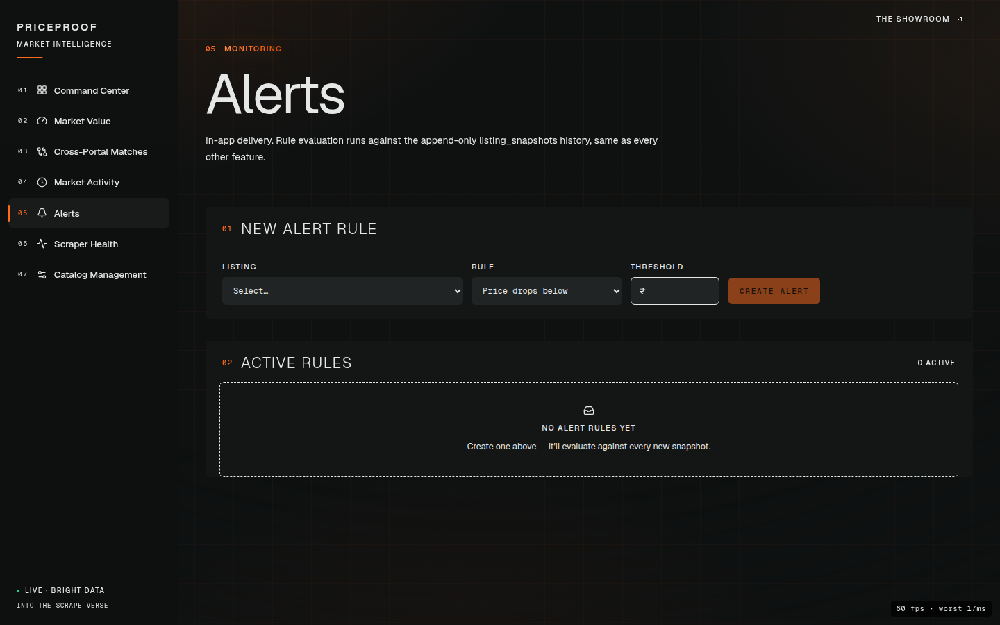

# PriceProof

A market-value and listings intelligence platform for used-car
marketplaces. It builds a continuous time-series record of listings
across portals, then turns that history into pricing intelligence no
single listing page can give you: whether an asking price is actually
fair relative to comparable cars, whether the same physical car is
cross-posted to two portals at two different prices, and how long a
listing sits — with real markdowns — before it sells.

Built for the "Into the Scrape-Verse" hackathon (WeMakeDevs × Bright Data),
Aug 17–23 2026.

## Screenshots

The marketing front door — a studio turntable cycling the vehicle segments
the platform actually scores, each shown as real photography, under a
reference-scale headline:



The Command Center — a live read on market value, days-on-market and
cross-portal price gaps, with the one live figure carrying the accent so the
eye lands on it first:



Market Value — every active listing scored against the median of comparable
cars, with the live price-flow ribbon:



The rest of the surface — cross-portal duplicate detection, market activity,
Scraper Studio health, and alerts — is in [`docs/screenshots/`](docs/screenshots/):

| | |
|---|---|
|  |  |
|  |  |

## Hard requirement

All scraping goes through **Bright Data Scraper Studio** — no Playwright,
Puppeteer, or raw HTTP scraping. The collector handles proxies,
geo-targeting, CAPTCHA, JS rendering, and self-healing; this repo only talks
to two REST endpoints (`dca/trigger`, `dca/dataset`). See
[`samples/README.md`](samples/README.md) for confirmed field notes on the
target portals, including known gaps and why VIN/full-plate matching isn't
the game here.

## Repo layout

```
db/schema.sql               Postgres schema (Supabase). Append-only listing_snapshots table.
backend/src/worker/          Bright Data trigger/poll client, ingestion worker, drift detection
backend/src/db/               migration runner, seed script (planted demo scenarios)
backend/src/api/               HTTP API for the frontend
frontend/                       React + Tailwind dashboard + landing page
.github/workflows/               scheduled scrape + self-healing CI (see below)
samples/                          real collector output + field provenance notes
```

## Data model

Catalog-driven: `portals` and `listings` are rows, not URLs baked into
scraper config. `listing_snapshots` is append-only and is the single
source of truth — every feature is a query over it, nothing is ever
updated in place. `is_seeded` marks generated demo history; the UI must
always label it as such, never present it as real scraped data.

What's different from a retail SKU catalog, and why: a car is (almost
always) sold by exactly one listing on one portal, so there's no
exact-match fan-out of one product across many stores. What replaces it:

- **Market-value scoring** instead of exact-SKU discount checking — group
  comparable active listings (same make+model, widened to make+model-year
  when a line is too thin) and score this listing's price against the
  segment median. Never scores against fewer than 5 comparables —
  `INSUFFICIENT_COMPARABLES` is a real verdict, not a fallback.
- **Delisting-based days-on-market** instead of an in-stock flip — a
  listing disappearing from a portal's results between two collection
  runs is the only sold/removed signal available, so that's what's
  tracked, bounded honestly by scrape cadence.
- **Fuzzy cross-portal matching** (make, model, year, registration
  prefix, city) instead of exact VIN matching — no India listings portal
  publishes a full VIN or plate on its results grid, so this was scoped
  around that from the start, not discovered as a limitation later.

See `db/schema.sql` for the full schema and the sketch of derived views
(market value, days-on-market, price cuts, cross-portal matches).

## Setup

```
cd backend
cp .env.example .env   # fill in DATABASE_URL (Supabase) and BRIGHT_DATA_API_TOKEN
npm install
npm run migrate         # applies db/schema.sql (idempotent, safe to re-run)
npm run seed             # generates ~60 days of demo history with planted scenarios
npm run dev               # starts the API on :3001
npm run collect           # one real Bright Data trigger/poll/ingest cycle

cd ../frontend
npm install
npm run dev   # starts the UI on :5173, proxies /api to :3001
```

Dashboard is at `/`, marketing landing page is at `/welcome`.

## Deploying (frontend to Vercel, backend elsewhere)

`frontend/` is a static Vite build — fine for Vercel. `backend/` is a
long-running Express server with a Postgres pool and a background worker;
it is **not** a Vercel serverless-shaped app, so it needs its own host
(Render/Railway/Fly.io/a VPS — anything that runs `npm start` in
`backend/` continuously). Two things had to be true before a static
deploy would actually work, both already in place:

- `frontend/vercel.json` — a catch-all rewrite to `index.html`. Without
  it, a hard refresh or a direct link to any route other than `/` 404s on
  Vercel (Vite's dev server fakes this locally, a plain static host
  doesn't).
- `frontend/src/lib/api.ts` reads `VITE_API_URL` and falls back to the
  relative `/api` path used in dev. Set `VITE_API_URL` to wherever the
  backend actually ends up hosted (e.g. `https://priceproof-api.onrender.com`)
  as a Vercel project env var — unset, nothing changes locally.

## Design

One design system — "Instrument" — mashed from four references, each
contributing the thing it does best rather than a slice of its look. The
tokens live in `frontend/src/index.css`, the motion tokens in
`frontend/src/lib/motion.ts`, and both the marketing pages and the eight
dashboard pages are built from them.

- **haoqi.design** — the substrate. A green-shifted near-black (`#0F1111`)
  with a four-step surface ladder, and a strict label opacity ladder
  (100 / 60 / 32 / 16) that does all the hierarchy work, so the UI never
  needs a second text color. Its signature easing,
  `cubic-bezier(.66,0,.01,1)`, is the house curve, and display type is set
  viewport-relative and clamped.
- **upvent.co** — monospace as the *structural* voice, not decoration:
  every eyebrow, table header, axis label and metadata key is mono,
  uppercase and widely tracked. Its progress/dash motion vocabulary shows
  up in the loading and collection-health states.
- **racing.porsche.com** — data-plate discipline. Indexed rows (`01`, `02`,
  …) in the gutter, near-square corners, hairline inset rings instead of
  borders, and an electric blue carrying structure and interaction.
- **primesec.ai** — an acid highlight against high-contrast neutral, used
  sparingly enough that it still reads as a signal rather than a theme.

The rule that keeps it coherent is that **color means something**:

- **Hot orange** (`--hot` / `--brand`, `#FF6B1A`) is the accent — logo, nav
  active state, section indices, the one primary CTA per page, and exactly
  one live figure per screen (the KPI that should be read first). It is kept
  out of the rest of the data views so it can never compete with a verdict.
- The **severity triad** (`--severity-violation` / `-genuine` / `-drift`)
  is the only other saturated color and always carries a verdict — crimson,
  teal and a cool yellow, each held clear of the accent's hue so a verdict
  never reads as emphasis and emphasis never reads as a verdict. The
  categorical chart slots avoid the triad's hues entirely.

The token values are measured off the reference stylesheets rather than
guessed at — haoqi.design's own surface ladder and label ramp, upvent.co's
6px radius and its gradient-headline treatment, racing.porsche.com's
near-monochrome data plates.

Shared building blocks rather than per-page styling: `PageHeader` opens
every dashboard page, `Panel`/`PanelRow` compose every section, `StatTile`
is the KPI readout, and the `surface`/`panel`/`label-mono`/`display-*`
utilities are defined once in `index.css`.

The marketing front door (`frontend/src/pages/Welcome.tsx`) leads with a
studio turntable cycling the vehicle segments the platform actually scores —
each rendered as real, licence-cleared photography of the model that segment
represents (Swift, City, Creta, E-Class; see
[`frontend/src/assets/cars/ATTRIBUTIONS.md`](frontend/src/assets/cars/ATTRIBUTIONS.md)),
falling back to a generated turntable only for segments with no photo — plus
a status ticker, a hairline-gridded figures band, and the capabilities as an
indexed flat list rather than a card grid.

### Performance

The interface is built to hold 60fps on a laptop, and that was verified by
measurement rather than assumed. The cost of a page is dominated by raster
and compositing, not JavaScript, so the work went there: the ambient
`feTurbulence` filter layers (re-rasterised per tile on every scroll frame)
were removed, every card's stacked shadow + gradient fill was flattened to a
single hairline, offscreen sections are skipped with `content-visibility`,
and all motion — including the accent's pulse and flow — is restricted to
`transform`/`opacity` so it composites without touching the raster path.
Over a full 8-second dashboard scroll that lands at ~78 raster tasks / under
7ms total. A dev-only FPS badge (`FpsBadge`, compiled out of production)
reports the mean and worst frame so any regression is visible immediately. The original landing
(`frontend/src/pages/Landing.tsx`, `frontend/src/components/landing/`) is
kept reachable at `/welcome/classic` and carries the same tokens; its "how
it works" section renders the real `PriceHistoryChart` component (not a
mockup) against a canned dataset, and its product-showcase section is a live
`iframe` of the actual running dashboard, so neither can go stale.

## Self-healing scraper cron

`.github/workflows/scrape-cron.yml` runs the real collection every 6 hours
via GitHub Actions, independent of anyone's laptop being on. On every run it
also compares field coverage against the previous run (`npm run
detect-drift`) — if a field that was reliably present has mostly or
entirely vanished, the target portal's shape has likely changed under the
scraper.

When that happens, a second job hands the drift report and the current
field-mapping code (`backend/src/worker/ingest.ts`) to
[`anthropics/claude-code-action`](https://github.com/anthropics/claude-code-action)
running non-interactively in CI. It reads the new raw JSON shape, patches
the mapping if the change is identifiable, and commits directly — no PR,
no human in the loop, by design for this hackathon. A third job then
re-runs the full collection against the healed code and re-checks drift;
if the fix didn't actually work, that job fails loudly rather than
reporting a false green. The Actions tab is the evidence: a run history of
real scrapes, and — if the target ever changes — a visible detect → heal →
re-verify cycle instead of a silent break.

Requires three repo secrets (Settings → Secrets and variables → Actions):
`DATABASE_URL`, `BRIGHT_DATA_API_TOKEN` (same values as `backend/.env`),
and `ANTHROPIC_API_KEY` (only needed for the heal job; the cron still runs
and reports drift without it, it just can't self-fix).

## Build order

1. [x] Schema + migrations + seed script with planted scenarios
2. [x] Bright Data client (trigger/poll/store) + ingestion worker
3. [x] Command Center + Listing Detail
4. [x] Market Value (hero feature)
5. [x] Scraper Health
6. [x] Cross-Portal Matches + Market Activity
7. [x] Alerts + Catalog Management
8. [x] Polish, empty states, demo script — full visual design pass (dark-terminal tokens, motion.dev + anime.js throughout, mobile-responsive), landing page, self-healing CI, demo script

If time runs short, cut from the bottom — never cut 4 or 5.

## Verified end-to-end (2026-08-19)

All dashboard pages plus the landing page checked with Playwright against
the live seeded database and API — real data renders correctly, zero
browser console errors across every route and nav interaction. Market
value scoring verified against the actual seeded segments (7-car Swift
segment correctly produces a Good deal at -21%, an Overpriced at +17%,
and five Fair listings around the median; a 2-car Creta segment correctly
returns Insufficient comparables at every widening level). Delisting/
days-on-market verified directly against the database (Nexon: 48 days
with 3 price cuts; Honda City: 3 days, no cuts). Cross-portal match
verified (Innova pair, Cars24 vs CarWale, 5.8% gap, needs_review=true).

**Known gaps, honestly:**
- Only two portals are connected (Cars24, CarWale) and neither has a real
  Scraper Studio collector wired up yet (`collector_id` is a placeholder
  until the first real run — see `samples/README.md`). No live Bright
  Data collection has run yet — Scraper Health is correctly empty, not
  broken.
- Market-value scoring only reaches a trustworthy segment for two make/
  model groups in the seeded data (Maruti Swift, and deliberately-thin
  Hyundai Creta) — every other seeded listing honestly returns
  Insufficient comparables rather than a low-confidence number. This is
  by design (the whole point of the verdict), but it means most of the
  catalog won't show a scored verdict until portal volume grows.
- Alert rules evaluate immediately on creation and again after every
  ingest (seed or live collection) — `price_below`/`price_drop_pct`/
  `below_market_value` fire on every snapshot the condition holds (an
  honest append-only record, not just the first breach), `sold` fires
  once on the delisting edge. There's no standing scheduler independent
  of ingest — a rule only re-checks when new data arrives, which is
  correct for this app (nothing changes between scrapes) but worth
  knowing.
